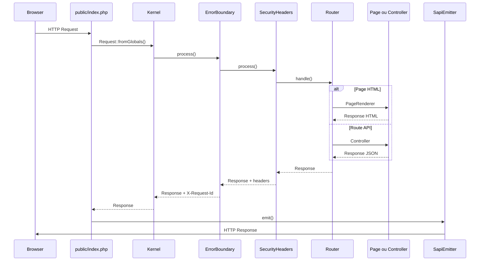

# CapsulePHP - Documentation

Version squelette : **Capsule Micro** avec couche **Capsule Pages** (architecture style Astro).

---

## Table des matières

1. [Présentation](#1-présentation)
2. [Prérequis et installation](#2-prérequis-et-installation)
3. [Structure du projet](#3-structure-du-projet)
4. [Cycle de vie d'une requête](#4-cycle-de-vie-dune-requête)
5. [Capsule Pages (front HTML)](#5-capsule-pages-front-html)
6. [Layouts et partials](#6-layouts-et-partials)
7. [Syntaxe des templates](#7-syntaxe-des-templates)
8. [Routes API et contrôleurs](#8-routes-api-et-contrôleurs)
9. [Injection de dépendances](#9-injection-de-dépendances)
10. [Couche HTTP](#10-couche-http)
11. [Middlewares](#11-middlewares)
12. [Sécurité](#12-sécurité)
13. [Base de données](#13-base-de-données)
14. [Configuration](#14-configuration)
15. [Outils CLI et Makefile](#15-outils-cli-et-makefile)
16. [Tests et qualité](#16-tests-et-qualité)
17. [Déploiement](#17-déploiement)
18. [Extension du framework](#18-extension-du-framework)
19. [Référence rapide](#19-référence-rapide)

---

## 1. Présentation

### 1.1 Philosophie

CapsulePHP est un squelette HTTP volontairement minimal :

- **Zéro dépendance Composer en production** (PHP 8.2+ seul)
- **Séparation nette** : `public/` (web), `resources/` (front), `app/` (back), `src/` (framework)
- **DX inspirée d'Astro** : une page HTML = un fichier, frontmatter YAML, layout automatique
- **Garde-fous intégrés** : code hors web, routage liste blanche, échappement XSS par défaut

### 1.2 Cas d'usage

| Adapté pour | Moins adapté pour |
|-------------|-------------------|
| Sites vitrine, landing pages, docs | SPA lourdes avec état client complexe |
| APIs REST légères | Microservices distribués à grande échelle |
| Prototypage rapide, apprentissage MVC | ORM complet, queues, events out of the box |

### 1.3 Métriques du squelette

| Élément | Valeur typique |
|---------|----------------|
| Fichiers `src/` | ~20 |
| Lignes framework | ~1 500 |
| Middlewares actifs | 2 (`ErrorBoundary`, `SecurityHeaders`) |
| Dépendance DB au boot | Non |

---

## 2. Prérequis et installation

### 2.1 Prérequis

| Outil | Version | Rôle |
|-------|---------|------|
| PHP | >= 8.2 | Runtime |
| SQLite 3 | optionnel | `bin/db` |
| Composer | optionnel | Tests, PHPStan, CS Fixer |

Extensions PHP recommandées : `pdo_sqlite`, `mbstring`, `json`.

### 2.2 Installation locale

```bash
git clone <repo> capsule
cd capsule
make init      # data/, bin/, config vérifiés
make dev       # http://localhost:8080
```

### 2.3 Installation manuelle

```bash
composer install          # dev uniquement
php -S localhost:8080 -t public public/index.php
```

Le document root **doit** pointer sur `public/`, jamais sur la racine du projet.

---

## 3. Structure du projet

```
capsule/
├── public/                     # Document root (seul dossier exposé au web)
│   ├── index.php               # Front controller
│   ├── .htaccess               # Rewrite Apache
│   └── assets/
│       └── css/                # Feuilles de style (voir § 6.4)
│           ├── base.css
│           ├── layouts/
│           ├── pages/{slug}/
│           └── partials/
│
├── resources/                  # Front source (non exécuté directement)
│   ├── pages/                  # Pages .html (routage automatique)
│   ├── layouts/                # Layouts HTML
│   └── partials/               # Composants réutilisables
│
├── app/                        # Code applicatif (back)
│   └── Http/                   # Contrôleurs API
│       └── HealthController.php
│
├── src/                        # Framework Capsule\ (kernel)
│   ├── Autoload.php
│   ├── Container.php
│   ├── Kernel.php
│   ├── Router.php
│   ├── View.php
│   ├── Frontmatter.php
│   ├── PageScanner.php
│   ├── PageRenderer.php
│   ├── PageRoute.php
│   ├── StylesheetResolver.php  # Résolution auto des CSS page/layout/section
│   ├── Http/                   # Request, Response, ResponseFactory
│   └── Middleware/             # ErrorBoundary, SecurityHeaders
│
├── config/
│   ├── app.php                 # is_dev, https, app_name
│   ├── routes.php              # Routes API (liste blanche)
│   ├── container.php           # Registre DI
│   └── database.php            # PDO optionnel
│
├── bootstrap/
│   └── app.php                 # Retourne [Container, Router]
│
├── migrations/
│   └── sqlite_init.sql         # PRAGMA SQLite (base vierge)
│
├── data/                       # SQLite locale (hors /mnt/)
├── bin/
│   ├── dev                     # Serveur PHP intégré
│   └── db                      # init | reset | shell
├── tests/
├── Makefile
└── setup-local.sh
```

### 3.1 Règles de nommage

| Namespace | Dossier | Contenu |
|-----------|---------|---------|
| `Capsule\` | `src/` | Framework, réutilisable |
| `App\` | `app/` | Logique métier du projet |
| `Tests\` | `tests/` | Tests PHPUnit |

---

## 4. Cycle de vie d'une requête



### 4.1 Étapes détaillées

1. **`public/index.php`** charge l'autoloader, bootstrap le container et le router.
2. **`Request::fromGlobals()`** normalise méthode, path, headers depuis `$_SERVER`.
3. **`Kernel`** exécute la pile de middlewares puis le router (handler terminal).
4. **`Router`** résout la route (API prioritaire, puis page statique, puis page dynamique).
5. **`SapiEmitter`** envoie status, headers et corps vers le client SAPI (Apache, FPM, `php -S`).

### 4.2 Ordre de résolution des routes

| Priorité | Source | Exemple |
|----------|--------|---------|
| 1 | Route exacte fusionnée (API gagne en cas de doublon) | `GET /api/health` |
| 2 | Page statique scannée | `GET /about` |
| 3 | Page dynamique `[param]` | `GET /blog/mon-article` |
| 4 | 405 si path connu, autre méthode | `POST /` |
| 5 | 404 | path inconnu |

---

## 5. Capsule Pages (SQLite + sections)

### 5.1 Modèle de données

Les pages vivent en **SQLite** (`data/database.sqlite`), pas en fichiers YAML/HTML.

| Table | Rôle |
|-------|------|
| `pages` | slug, title, layout, description, `sections` (JSON), `meta` (JSON SEO) |
| `site_settings` | thème global (`theme` JSON → variables CSS) |

Slug vide `''` = page d'accueil `/`.

Exemple `sections` JSON :

```json
[
  {
    "id": "hero-1",
    "type": "hero",
    "variant": "centered",
    "content": { "title": "Bienvenue", "subtitle": "…" },
    "style": { "bg": "primary", "padding": "xl" }
  }
]
```

Les templates HTML des sections sont dans `resources/sections/{type}/{variant}.html` (bibliothèque framework).

### 5.2 Initialisation

```bash
bin/db init    # schéma + seed (accueil avec hero, features, cta)
bin/db reset   # repart de zéro
```

### 5.3 Routage

`PageRegistry` lit les pages publiées en DB et enregistre `GET /{slug}`.

### 5.4 Dashboard développeur (`/dev`)

| URL | Rôle |
|-----|------|
| `/dev` | Login (`DEV_PASSWORD`) |
| `/dev/pages` | Liste / création de pages |
| `/dev/pages/{slug}` | Éditeur sections + aperçu iframe (`/dev/preview/{slug}`) |
| `/dev/site` | Identité, navigation, CTA header, partials header/footer |
| `/dev/theme` | Couleurs, polices, espacement + aperçu (`/dev/preview/_`) |
| `/dev/preview/{slug}` | Rendu public sans contrainte `published` (iframe uniquement) |

#### Flux site builder

1. `make init` puis `/dev` — pages, sections, publication.
2. `/dev/site` — nom, pied de page, navigation (pages + liens externes + boutons), CTA header optionnel.
3. `/dev/theme` — tokens CSS (`--color-*`, `--font-*`, `--spacing-section`).
4. Publier les pages ; la nav auto suit les pages publiées tant qu'aucune édition nav explicite n'a lieu.

#### Navigation (`site_settings.site`)

```json
{
  "nav_mode": "auto",
  "nav_items": [
    { "id": "nav-1", "type": "page", "slug": "", "label": "Accueil", "visible": true },
    { "id": "nav-2", "type": "link", "href": "https://…", "label": "GitHub", "visible": true },
    { "id": "nav-3", "type": "button", "href": "/contact", "label": "Contact", "visible": true }
  ],
  "header_cta": { "enabled": false, "label": "", "href": "" }
}
```

- `nav_mode: auto` — liens dérivés des pages publiées (`home_label` pour l'accueil).
- Première sauvegarde nav explicite → `nav_mode: custom` et persistance de `nav_items`.
- `visible: false` masque une entrée sur le site public ; l'éditeur conserve le réglage.

#### Sections

- Variantes déclarées dans `resources/sections/registry.yaml` (clés avec tirets autorisées, ex. `grid-3`).
- `SectionsController` valide la variante via `SectionRegistry::getVariants()` ; fallback sur la première variante valide.
- Champ `visible` sur chaque section : masquée sur le site public, toujours éditable dans `/dev`.

#### Thème et CSS

- `{{{stylesheets}}}` puis `{{{theme_css}}}` dans `resources/layouts/default.html` (cascade correcte).
- `public/assets/css/base.css` — structure uniquement ; pas de couleurs/polices fixes dans `:root`.
- `SiteRepository::themeCss()` injecte les variables depuis la DB.

#### Requêtes HX / AJAX dev

- Trait `DevHx` : en-tête `HX-Request` détecté sans sensibilité à la casse.
- Partials dev sans layout complet ; `data-dev-ajax` dans `dev.js` pour sections et nav.
- `preview_url` des écrans avec iframe : toujours `/dev/preview/…` (CSP `frame-ancestors 'self'` sur `/dev/*`).

Le dashboard **client** (`/admin`) est prévu en phase 3.

### 5.5 Backup

```bash
bin/site export > backup.json
bin/site import < backup.json
```

### 5.6 Legacy YAML (optionnel)

`YamlData` et `Frontmatter` restent pour `resources/sections/registry.yaml` et usage legacy. Les pages publiques ne passent plus par `resources/pages/*.yaml`.

---

## 6. Layouts et partials

### 6.1 Layouts

Emplacement : `resources/layouts/`

Exemple `resources/layouts/default.html` :

```html
<!doctype html>
<html lang="fr">
<head>
    <meta charset="utf-8" />
    <meta name="viewport" content="width=device-width, initial-scale=1" />
    <title>{{title}}</title>
    <meta name="description" content="{{description}}" />
    {{{stylesheets}}}
</head>
<body>
    {{> header.html}}
    <main>
        {{{content}}}
    </main>
    {{> footer.html}}
</body>
</html>
```

- `{{{content}}}` : corps de la page (HTML non ré-échappé, déjà sûr côté template)
- `{{{stylesheets}}}` : balises `<link>` injectées automatiquement par `StylesheetResolver`
- `layout: blog` dans le frontmatter charge `resources/layouts/blog.html`

### 6.2 Partials

Emplacement : `resources/partials/`

Exemple `resources/partials/header.html` :

```html
<header>
    <nav>
        <a href="/">Accueil</a>
        <a href="/about">À propos</a>
    </nav>
</header>
```

Inclusion : `{{> header.html}}`

Résolution : `resources/partials/` en priorité, puis `resources/layouts/`.

### 6.3 CSS

Emplacement : `public/assets/css/`

Convention pour rester propre : **un dossier par page**, les fichiers CSS à l'intérieur.

```
public/assets/css/
├── base.css                        # global (tokens, reset léger)
├── layouts/
│   └── default.css                 # layout default
├── pages/
│   └── {slug}/                     # slug = nom du fichier page (ex. index, about)
│       ├── {slug}.css              # styles propres à la page
│       ├── hero.css                # section (optionnel)
│       └── intro.css               # section (optionnel)
└── partials/
    └── site-header.css             # partial réutilisable
```

| Fichier | Quand le créer |
|---------|----------------|
| `pages/{slug}/{slug}.css` | À chaque nouvelle page |
| `pages/{slug}/{section}.css` | Une section HTML avec styles dédiés |
| `layouts/{layout}.css` | Styles du layout (`layout:` dans le YAML) |
| `partials/{nom}.css` | Partial inclus via `{{> nom.html}}` |

**Chargement automatique** : `StylesheetResolver` (via `PageRenderer`) génère les `<link>` dans le layout. Ordre de résolution :

1. `base.css`
2. `layouts/{layout}.css`
3. `pages/{slug}/{slug}.css`
4. `pages/{slug}/{section}.css` — sections déclarées dans le YAML
5. `partials/{partial}.css` — partials détectés dans le HTML ou le YAML

Déclarer les sections CSS dans le YAML de la page :

```yaml
title: Accueil
layout: default
styles_sections: hero, intro
```

Exemple pour une page `about` :

```
resources/pages/about.yaml
resources/pages/about.html
public/assets/css/pages/about/about.css
```

Ne pas lier les CSS manuellement dans le layout : tout passe par `{{{stylesheets}}}`.

### 6.4 SEO et données structurées

Le layout `default.html` inclut :

- `meta name="description"`
- `link rel="canonical"`
- balises Open Graph (`og:title`, `og:description`, `og:url`)
- JSON-LD `WebPage` via `{{{json_ld}}}`

Champs YAML recommandés par page :

```yaml
title: Ma page
description: Résumé unique pour Google et les réseaux sociaux.
schema_type: WebPage
schema_name: Ma page
canonical: https://example.com/ma-page   # optionnel, auto-généré sinon
```

**Canonical auto** : `Seo::apply()` construit l'URL à partir de `base_url` (`APP_URL`) et du path de la requête.

**JSON-LD automatique** : généré côté PHP avec `json_encode` à partir des champs `schema_*` :

| Champ YAML | Propriété JSON-LD |
|------------|-------------------|
| `schema_type` | `@type` (défaut `WebPage`) |
| `schema_name` | `name` (défaut `title`) |
| `description` | `description` |
| `canonical` | `url` |
| `schema_headline` | `headline` |
| `schema_datePublished` | `datePublished` |
| `schema_*` | propriété `*` (camelCase) |

Les champs `schema_*` sont retirés des variables template après construction du JSON (réservés au SEO).

**Override complet** : un bloc `json_ld` dans le YAML reste prioritaire :

```yaml
json_ld:
  "@context": "https://schema.org"
  "@type": "FAQPage"
  name: FAQ
```

Le tableau YAML est encodé en JSON sûr avant injection dans le layout via `{{{json_ld}}}`.

---

## 7. Syntaxe des templates

Moteur minimal intégré (`Capsule\View`).

| Syntaxe | Comportement | Exemple |
|---------|--------------|---------|
| `{{var}}` | Échappé HTML (`htmlspecialchars`) | `{{title}}` |
| `{{{var}}}` | Brut (HTML autorisé) | `{{{content}}}` |
| `{{> partial.html}}` | Inclusion partial/layout | `{{> nav.html}}` |
| `{{obj.key}}` | Accès imbriqué | `{{user.name}}` |

### 7.1 Bonnes pratiques XSS

- Données utilisateur : toujours `{{var}}`
- HTML généré par le framework (contenu de page) : `{{{content}}}`
- Ne jamais mettre du PHP dans les fichiers `.html`

---

## 8. Routes API et contrôleurs

### 8.1 Déclaration

Fichier `config/routes.php` :

```php
<?php

declare(strict_types=1);

use App\Http\HealthController;
use App\Http\StatusController;

return [
    'GET /api/health' => [HealthController::class, 'health'],
    'GET /api/status' => [StatusController::class, 'index'],
    'POST /api/contact' => [ContactController::class, 'submit'],
];
```

Format clé : `"{METHOD} {path}"` (path normalisé, slash initial).

### 8.2 Contrôleur

Fichier `app/Http/StatusController.php` :

```php
<?php

declare(strict_types=1);

namespace App\Http;

use Capsule\Http\Factory\ResponseFactory;
use Capsule\Http\Message\Response;

final class StatusController
{
    public function __construct(
        private readonly ResponseFactory $responseFactory,
    ) {
    }

    public function index(): Response
    {
        return $this->responseFactory->json([
            'status' => 'ok',
            'version' => '1.0.0',
        ]);
    }
}
```

**Convention** : les méthodes retournent toujours un objet `Response`.

### 8.3 Enregistrement DI

Dans `config/container.php` :

```php
$c->set(StatusController::class, static fn (Container $c) => new StatusController(
    $c->get(ResponseFactory::class),
));
```

### 8.4 Priorité API vs pages

Les routes de `config/routes.php` sont fusionnées **après** le scan des pages. En cas de conflit sur la même clé `GET /foo`, l'API l'emporte.

**Recommandation** : préfixer toutes les routes back par `/api/`.

---

## 9. Injection de dépendances

### 9.1 Container minimal

`Capsule\Container` : registre simple avec factories lazy.

```php
$c = new Container();
$c->set('config', static fn () => require 'config/app.php');
$c->set(MyService::class, static fn (Container $c) => new MyService(
    $c->get('config'),
));
$service = $c->get(MyService::class);
```

### 9.2 Point d'entrée unique

Tout le câblage applicatif vit dans `config/container.php`. Pas de ServiceProviders, pas d'attributs de découverte.

### 9.3 Ajouter un service métier

```php
// config/container.php
$c->set(\App\Services\ContactService::class, static fn (Container $c) => new \App\Services\ContactService(
    $c->get('config'),
));

// app/Http/ContactController.php
public function __construct(
    private readonly ContactService $contacts,
    private readonly ResponseFactory $responseFactory,
) {}
```

---

## 10. Couche HTTP

### 10.1 Request

`Capsule\Http\Message\Request` : objet immuable.

```php
$request = Request::fromGlobals();
$request->method;   // GET, POST, ...
$request->path;    // /api/health (normalisé)
$request->query;   // $_GET
$request->headers; // tableau associatif
```

### 10.2 Response

`Capsule\Http\Message\Response` : immuable, chaînage via `withHeader`, `withStatus`, `withBody`.

### 10.3 ResponseFactory

Méthodes utiles :

| Méthode | Usage |
|---------|-------|
| `html($body)` | Page HTML |
| `json($data)` | API JSON |
| `text($body)` | Texte brut |
| `redirect($url)` | Redirection 302 |
| `empty(204)` | Réponse sans corps |
| `problem($array, 400)` | RFC 7807 problem+json |

Exemple :

```php
return $this->responseFactory->json(['items' => $items], 200);
```

---

## 11. Middlewares

### 11.1 Pile actuelle

Définie dans `public/index.php` :

```php
$middlewares = [
    $container->get(ErrorBoundary::class),
    $container->get(SecurityHeaders::class),
];
```

### 11.2 ErrorBoundary

- Capture `HttpException` (4xx/5xx) et `\Throwable` (500)
- Réponse JSON structurée avec `requestId`, `error`, `request`
- Mode debug (`is_dev`) : ajoute `debug.exception`, `file`, `line`
- Ajoute `X-Request-Id` sur toutes les réponses

Format erreur :

```json
{
  "requestId": "a1b2c3d4e5f6g7h8",
  "status": 404,
  "error": {
    "type": "not_found",
    "message": "Not Found"
  },
  "request": {
    "method": "GET",
    "path": "/inconnu"
  }
}
```

### 11.3 SecurityHeaders

Headers ajoutés si absents :

| Header | Valeur |
|--------|--------|
| `Content-Security-Policy` | `default-src 'self'; ...` |
| `X-Content-Type-Options` | `nosniff` |
| `Referrer-Policy` | `no-referrer` |
| `X-Frame-Options` | `DENY` |
| `Strict-Transport-Security` | prod + HTTPS uniquement |

### 11.4 Ajouter un middleware

1. Créer `src/Middleware/MonMiddleware.php` implémentant `MiddlewareInterface`
2. Enregistrer dans `config/container.php`
3. Ajouter dans le tableau `$middlewares` de `public/index.php`

```php
interface MiddlewareInterface
{
    public function process(Request $request, HandlerInterface $next): Response;
}
```

---

## 12. Sécurité

### 12.1 Garde-fous intégrés

| Risque | Mitigation |
|--------|------------|
| Code source exposé | Document root = `public/` uniquement |
| Routage arbitraire | Liste blanche : scan `resources/pages/` + `config/routes.php` |
| XSS | `{{var}}` échappé par défaut |
| Path traversal | `realpath()` + préfixe `resources/pages/` |
| PHP dans les pages | Corps `.html` = texte, jamais `eval()` ni `include` |
| Erreurs en prod | Pas de stack trace sans `is_dev` |
| Clickjacking | `X-Frame-Options: DENY`, CSP `frame-ancestors 'none'` |
| MIME sniffing | `X-Content-Type-Options: nosniff` |

### 12.2 Apache

`public/.htaccess` :

- Rewrite vers `index.php` si fichier/dossier absent
- `Options -Indexes` (pas d'énumération de répertoire)

### 12.3 Checklist production

- [ ] `APP_ENV=prod` (désactive le debug)
- [ ] `APP_HTTPS=1` si TLS actif (active HSTS)
- [ ] Document root = `public/`
- [ ] Permissions fichiers : pas d'écriture web sur `src/`, `app/`, `config/`
- [ ] Pas de fichier `.php` dans `public/assets/`

---

## 13. Base de données

### 13.1 Optionnelle au boot

Le framework démarre **sans** PDO. La DB est disponible quand vous en avez besoin via `config/database.php`.

### 13.2 Initialisation

```bash
bin/db init     # Crée SQLite + PRAGMA
bin/db reset    # Réinitialise (destructif)
bin/db shell    # Console sqlite3
```

### 13.3 Emplacement SQLite

| Environnement | Chemin |
|---------------|--------|
| Local standard | `data/database.sqlite` |
| Disque réseau `/mnt/` | `/tmp/capsule-db-<hash>/database.sqlite` |

Override : variable `DB_SQLITE` ou `DB_DSN` dans l'environnement.

### 13.4 Réintroduire PDO dans l'app

1. Créer un service `App\Services\Database` utilisant `config/database.php`
2. L'enregistrer dans `config/container.php`
3. L'injecter dans vos contrôleurs ou futurs `*.data.php`

Le schéma métier n'est **pas** inclus : `migrations/sqlite_init.sql` ne contient que des PRAGMA.

---

## 14. Configuration

### 14.1 `config/app.php`

```php
return [
    'is_dev' => (($_ENV['APP_ENV'] ?? 'dev') !== 'prod'),
    'https' => (($_ENV['APP_HTTPS'] ?? '0') === '1'),
    'app_name' => $_ENV['APP_NAME'] ?? 'CapsulePHP',
    'base_url' => $_ENV['APP_URL'] ?? 'http://localhost:8080',
    'password_min_length' => (int) ($_ENV['PASSWORD_MIN_LENGTH'] ?? 8),
];
```

### 14.2 Variables d'environnement

| Variable | Défaut | Effet |
|----------|--------|-------|
| `APP_ENV` | `dev` | `prod` désactive le debug ErrorBoundary |
| `APP_HTTPS` | `0` | `1` active HSTS en prod |
| `APP_NAME` | `CapsulePHP` | Nom dans les réponses d'erreur |
| `APP_URL` | `http://localhost:8080` | URL de base pour canonical et JSON-LD |
| `DB_DSN` | auto SQLite | DSN PDO personnalisé |
| `PORT` | `8080` | Port `make dev` |

### 14.3 Accès config dans l'app

```php
/** @var array $config */
$config = $container->get('config');
$isDev = $config['is_dev'];
```

---

## 15. Outils CLI et Makefile

### 15.1 `bin/dev`

Lance le serveur PHP intégré avec `public/` en document root et `public/index.php` en routeur.

### 15.2 `bin/db`

```bash
bin/db init    # Initialise la base
bin/db reset   # Réinitialise
bin/db shell   # REPL sqlite3
```

### 15.3 Makefile (cibles principales)

| Cible | Description |
|-------|-------------|
| `make init` | Setup local complet |
| `make dev` | Serveur de développement |
| `make test` | PHPUnit |
| `make phpstan` | Analyse statique |
| `make db.init` | `bin/db init` |
| `make doc` | Ouvre cette documentation |
| `make open` | Ouvre le navigateur sur le port local |

---

## 16. Tests et qualité

### 16.1 Lancer les tests

```bash
composer install
vendor/bin/phpunit --testdox
# ou
make test
```

### 16.2 Couverture des tests fournis

| Fichier | Sujet |
|---------|-------|
| `FrontmatterTest` | Parse YAML + corps |
| `PageScannerTest` | Mapping fichier/URL, `[slug]` |
| `PageRendererTest` | Échappement XSS |
| `RouterTest` | Dispatch, priorité API, 404/405 |
| `ViewTest` | Syntaxe template |
| `Http/RequestTest` | Normalisation requête |
| `Http/ResponseTest` | Immutabilité headers |

### 16.3 Analyse statique

```bash
make phpstan
```

---

## 17. Déploiement

### 17.1 Apache

```apache
<VirtualHost *:80>
    ServerName example.com
    DocumentRoot /var/www/capsule/public

    <Directory /var/www/capsule/public>
        AllowOverride All
        Require all granted
    </Directory>
</VirtualHost>
```

### 17.2 Nginx

```nginx
server {
    listen 80;
    server_name example.com;
    root /var/www/capsule/public;
    index index.php;

    location / {
        try_files $uri $uri/ /index.php?$query_string;
    }

    location ~ \.php$ {
        fastcgi_pass unix:/run/php/php8.2-fpm.sock;
        fastcgi_param SCRIPT_FILENAME $document_root$fastcgi_script_name;
        include fastcgi_params;
    }
}
```

### 17.3 PHP-FPM

- `DocumentRoot` → `public/`
- `APP_ENV=prod`, `APP_HTTPS=1` si TLS
- Permissions : propriétaire deploy, pas d'écriture sur le code

### 17.4 Assets statiques

Placer CSS/JS/images dans `public/assets/`. Le CSS page suit `public/assets/css/pages/{slug}/{fichier}.css` (voir § 6.3). Les feuilles sont injectées automatiquement ; ne pas hardcoder de `<link>` dans les layouts.

---

## 18. Extension du framework

### 18.1 Feuille de route suggérée

| Fonctionnalité | Approche |
|----------------|----------|
| Données dynamiques pages | `resources/pages/*.data.php` (whitelist) |
| Content Collections | `content/*.md` + générateur de routes |
| Auth | Middleware `AuthRequired` + sessions |
| Formulaires | Contrôleur POST + CSRF |
| Islands HTMX | Partials + attributs `hx-*` ciblés |
| Cache pages | Middleware cache sur GET statiques |

### 18.2 Ce qu'il ne faut pas faire

- Mettre de la logique métier dans `src/` (réservé au framework)
- Exposer `resources/` ou `app/` via le web server
- Ajouter des routes hors liste blanche (pas d'include dynamique de contrôleurs)
- Utiliser `{{{var}}}` pour des données utilisateur

### 18.3 Exemple : page « À propos »

1. Créer `resources/pages/about.yaml` :

```yaml
title: À propos
layout: default
message: Notre histoire.
```

2. Créer `resources/pages/about.html` :

```html
<h1>{{title}}</h1>
<p>{{message}}</p>
```

3. Créer `public/assets/css/pages/about/about.css` (styles de la page).
4. Aucune route à déclarer : le scan automatique expose `GET /about`.

### 18.4 Exemple : endpoint API complet

1. `app/Http/ContactController.php`
2. Entrée dans `config/routes.php` : `'POST /api/contact' => [...]`
3. Enregistrement dans `config/container.php`

---

## 19. Référence rapide

### Arborescence minimale pour démarrer

```
public/index.php
resources/pages/index.yaml
resources/pages/index.html
resources/layouts/default.html
app/Http/HealthController.php
config/routes.php
config/container.php
```

### URLs par défaut

| URL | Handler |
|-----|---------|
| `GET /` | `resources/pages/index.html` |
| `GET /api/health` | `HealthController::health()` |

### Fichiers à modifier selon le besoin

| Besoin | Fichier(s) |
|--------|------------|
| Nouvelle page | `resources/pages/*.html` |
| Layout | `resources/layouts/*.html` |
| Partial | `resources/partials/*.html` |
| API | `config/routes.php`, `app/Http/*.php`, `config/container.php` |
| Middleware | `src/Middleware/`, `public/index.php` |
| Config | `config/app.php` |
| DI | `config/container.php` |

---

*Documentation CapsulePHP - squelette Capsule Micro + Capsule Pages.*
